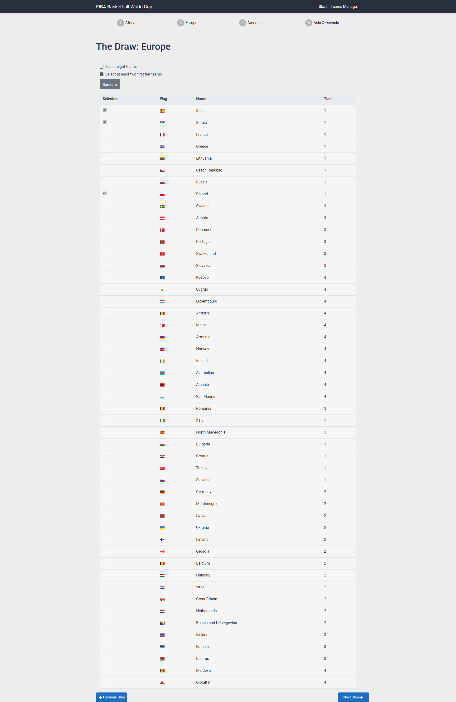
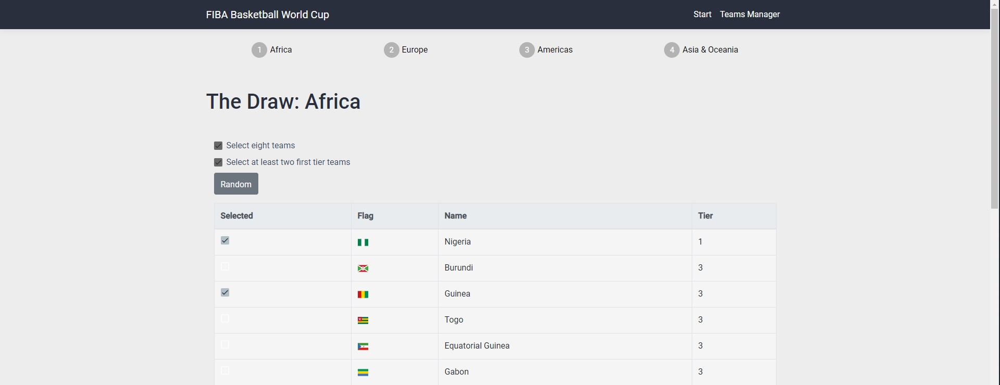
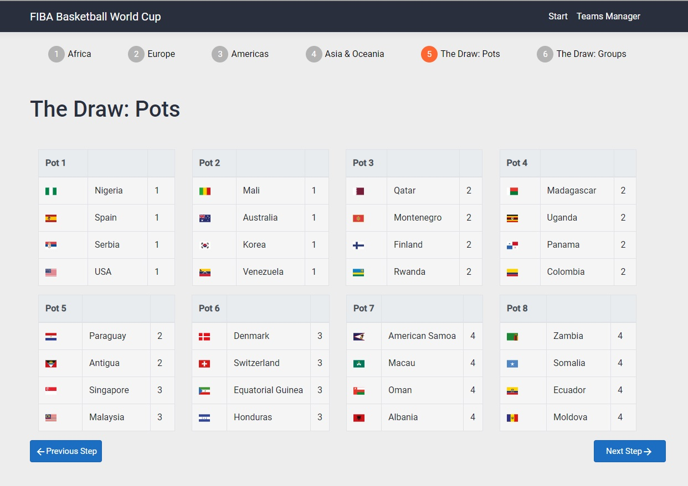
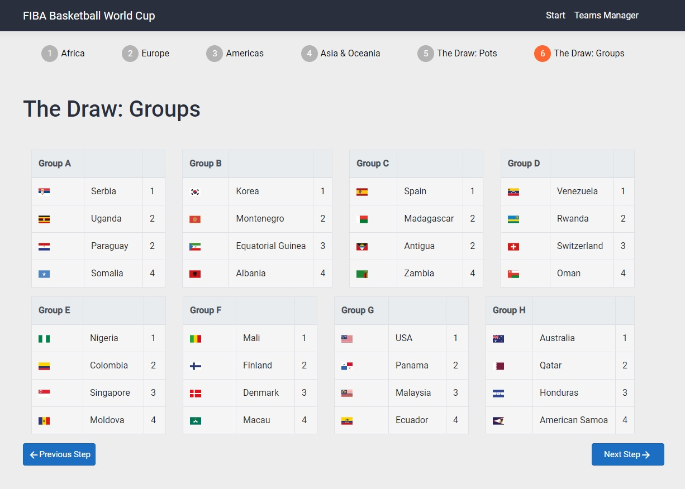

# Symulacja Mistrzostw Świata w Koszykówce

TODO:
- [x] Wybór drużyn
- [x] Walidacja wyboru
- [x] Losowanie
- [ ] Pierwsza Faza Grupowa
- [ ] Druga Faza Grupowa
- [ ] Faza Finałowa

## Wybór drużyn do mistrzostw
### Rozpoczęcie symulacji
Symulację można rozpocząć wybierając opcję "Start" z menu nawigacyjnego. 
\
Pokaże nam się panel wyboru drużyn. \
Pełna strona wygląda tak: 

### Wybór drużyny
Następnie należy wybrać drużyny, które wezmą udział w turnieju poprzez kliknięcie na nią. 
Wybrana drużyna zostanie zaznaczona. Można również odznaczyć wcześniej zaznaczoną opcję klikając na nią ponownie. 

### Walidacja
Każdy z panelu wyboru drużyn (jest ich cztery, dla każdej z Konfederacji - Europa, Azja i Oceania, Ameryki oraz Afryka) 
posiada walidację mówiącą, czy podana Konfederacja może przystąpić do turnieju: 
1. Każda z Konfederacji musi posiadać dokładnie dwie drużyny o sile 1. 
2. Każda z Konfederacji musi posiadać łącznie 8 drużyn. 

Po spełnieniu tych ograniczeń pola wyboru (ang. checkboxes) zostaną zaznaczone jako spełnione. 

### Przejście do następnej Konfederacji
Ponadto po wybraniu drużyn zostanie odblokowany przycisk przekierowujący do wyboru drużyn z następnej Konfederacji. 
A w wypadku chęci zmiany poprzedniej Konfederacji przycisk "Previous Step" pozwolil się cofnąć. 

### Losowanie: Podział na koszyki
Po wybraniu drużyn dla każdej konfederacji aplikacja podzieli nasze drużyny na koszyki na podstawie siły każdej z nich. 
Najsilniejsze z nich znajdą się w pierwszych koszykach. 

### Losowanie: Podział na grupy A-H
Tworzenie grup odbywa się poprzez wybranie losowego zespołu z każdego koszyka 1, 4, 5, 8 i umieszczenie go do jednej z grup A, C, E, G. 
Analogicznie tworzone są grupy B, D, F, H z koszyków 2, 3, 6, 7. 
