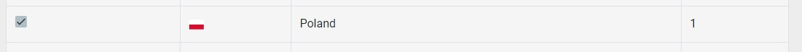
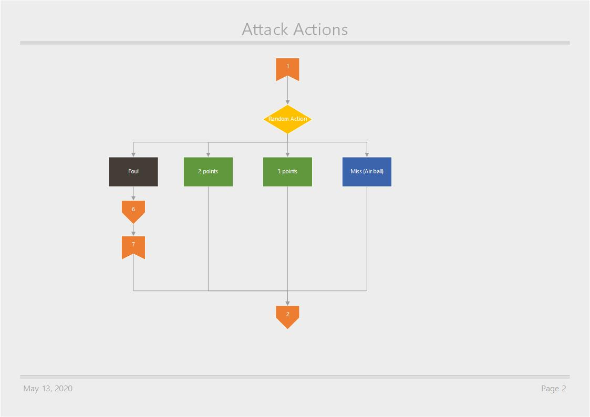

# Symulacja Mistrzostw Świata w Koszykówce

TODO:
- [x] Wybór drużyn
- [x] Walidacja wyboru
- [x] Losowanie
- [x] Pierwsza Faza Grupowa
- [ ] Druga Faza Grupowa
- [ ] Faza Finałowa

## Wybór drużyn do mistrzostw
### Rozpoczęcie symulacji
Symulację można rozpocząć wybierając opcję "Start" z menu nawigacyjnego. 
\
Pokaże nam się panel wyboru drużyn. \
Pełna strona wygląda tak: 

### Wybór drużyny
Następnie należy wybrać drużyny, które wezmą udział w turnieju poprzez kliknięcie na nią. 
Wybrana drużyna zostanie zaznaczona. Można również odznaczyć wcześniej zaznaczoną opcję klikając na nią ponownie. 

### Walidacja
Każdy z panelu wyboru drużyn (jest ich cztery, dla każdej z Konfederacji - Europa, Azja i Oceania, Ameryki oraz Afryka) 
posiada walidację mówiącą, czy podana Konfederacja może przystąpić do turnieju: 
1. Każda z Konfederacji musi posiadać dokładnie dwie drużyny o sile 1. 
2. Każda z Konfederacji musi posiadać łącznie 8 drużyn. 

Po spełnieniu tych ograniczeń pola wyboru (ang. checkboxes) zostaną zaznaczone jako spełnione. 

### Przejście do następnej Konfederacji
Ponadto po wybraniu drużyn zostanie odblokowany przycisk przekierowujący do wyboru drużyn z następnej Konfederacji. 
A w wypadku chęci zmiany poprzedniej Konfederacji przycisk "Previous Step" pozwolil się cofnąć. 

## Losowanie
### Podział na koszyki
Po wybraniu drużyn dla każdej konfederacji aplikacja podzieli nasze drużyny na koszyki na podstawie siły każdej z nich. 
Najsilniejsze z nich znajdą się w pierwszych koszykach. 

### Podział na grupy A-H
Tworzenie grup odbywa się poprzez wybranie losowego zespołu z każdego koszyka 1, 4, 5, 8 i umieszczenie go do jednej z grup A, C, E, G. 
Analogicznie tworzone są grupy B, D, F, H z koszyków 2, 3, 6, 7. 

### Przykład podziału na koszyki i losowania drużyn
Dla poniżej zaprezentowanego podziału na koszyki. 

Możemy otrzymać następujące grupy: 

W przypadku otrzymania takiego podziału na grupy, stały sie następujące rzeczy. 
1. Z koszyków 1, 4, 5, 8 wybraliśmy losowo po jednej drużynie i wrzuciliśmy do Grupy A. 

2. Następnie z tych samych koszyków, pomijając poprzednio wybrane drużymy, losujemy po jednej drużynie do Grupy C

3. Operację 2 powtarzamy dla grup E i G. 
4. Analogicznie jak w przypadku kroków 1-3 działamy z grupami B, D, F, H i koszykami 2, 3, 6, 7. 

## Pierwsza Faza Grupowa
### Tworzenie par
W ramach każdej grupy odbywają się sparingi mające na celu wybrać dwóch zwycięzców. 
Każda drużyna zagra z każdą inną drużyną w grupie. Łącznie odbędzie się 48 rozgrywek (3 przypadają dla każdej drużyny, 6 w każdej grupie). 

### Symulacja meczu
Aplikacja dla każdej siły przypisuje odpowiednie statystyki takie jak: zdolność ataku (ang. attack), zdolność obrony przed kradzieżą piłki (ang. steal) i zdolność popełnienia faulu (ang. foul). 
Każdej ze zdolności przypisuje się wartość liczbową z zakresu (0, 1), tak aby ich suma dla siły wynosiła 1 (100%). Liczba ta odpowiada za procentową szansę wystąpienia zdarzenia danego typu. 

Każda ze zdolności wpływa na różne wydarzenia podczas meczu. Na początku generowania zdarzenia/akcji aplikacja sprawdza jaką siłę ma drużyna aktualnie trzymająca piłkę. Na tej podstawie losuje z jakiej kategorii będzie akcja (atak, utrata piłki, faul). 

W wypadku ataku sprawdzana jest szansa na zdobycie dwóch lub trzech punktów. Może się też zdażyć, że piłka nie trafi do kosza lub zostanie popełniony faul w ataku przez attakującego. 

Po wygenerowaniu akcji dla aktualnej drużyny doliczany jest czas jej trwania do ogólnego czasu trwania meczu. Upłynięcie czasu 40 minut (4 kwarty po 10 minut) jest sygnałem do zakończenia meczu. 
Generowanie akcji odbywa się na zmianę dla każdej drużyny. 

Przykładowy rezultat rozgrywek w Pierwszej Fazie Grupowej. W każdej tabeli przypisanej do grupy znajdują się informacje jakie drużyny brały udział w meczu i ile punktów udało im się zdobyć. 
